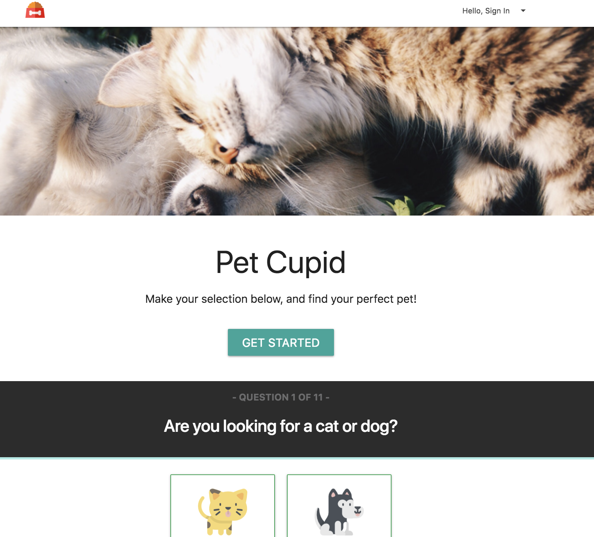

# Pet Cupid App
Pet Cupid application with MySQL, NODE, Express, Handlebars, Sequalize.

## Description
This application uses a Pet Finder API, to match perspective pet owners wih their ideal pet given certain requirements and personalities based on what the perspective owner indicates through filling out a survey. 

The application demonstrates a fullstack application with a front end implemented with HTML/CSS and elements from Materalize framework and the back end implemented with Node.js, Express and Sequalize. HTML templating is done with the help of Handlebars.

## Specifications
* Designed algorithim to create a personality profile with the given values assigned to survey questions to best match pets.
* Proxied through backend to access Pet Finder database.
* Hide and removed class attribute to shuffle through survey questions.

## Installation
To install the application follow the following instructions below:
```javascript
git clone github.com/kmvincent/Project2.git
cd Project2
npm install
```

## Demo
* [Deployment via Heroku](https://petcupid.herokuapp.com/)
* [Demo Video](https://drive.google.com/file/d/1e9KM4AWCUkxfoeddi4Kxv_gWOjRdP_dg/view?usp=sharing)
* 


